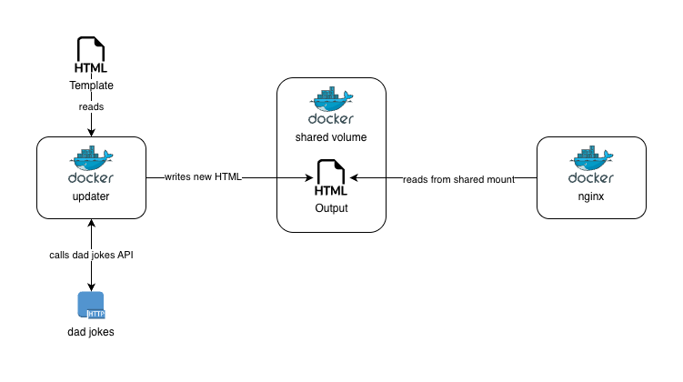

# NGINX dad jokes service with non-root user

This sample contains docker-compose / podman-compose services intended to:
* Call an url to get some dad jokes.
* Update a templated html file with the new content.
* Present it on `localhost:8080` throught `nginx`.

You can pass arguments to the `updater` script as the template path, output path and sleep interval for it.

The flow is the following:



The challenge was to actually make nginx not run as root, and not update back permissions to the default `index.html` file fron it.

Another aspect was the `cap-ad` that was needed in the end to be added to the docker compose file for nginx, as docker sets the down limit to ports for non-root users to bind to 0,
so I had to set `cap-ad` with at least `NET_BIND_SERVICE`.

Both users on both containers share the same UID / GUID (101), but not sure if that would do any difference in the end.

It's a small project that can show how ton put containers, even with some hard dependency as the volumes here, to run as non-root.

### Running

```bash
docker compose up --build
```

Or

```bash
podman-compose up --build
```

The `--build` can be removed, but if you push further changes mainly to code, build it again.

In order to remove the volumes included on the `compose` recipe, after cancelling the compose execution, or when bringing it down run the following:

```bash
docker comnpose down -v
```

Or

```bash
podman-conmpose down -v
```

### References

Some references I've found on the way to surpass some of the issues:

* https://forums.docker.com/t/running-nginx-official-image-as-non-root/135759/17
* https://forums.docker.com/t/cant-assign-to-priviliged-ports-1024/8931
* https://forums.docker.com/t/non-root-user-able-to-bind-to-port-80-why/140524/4
